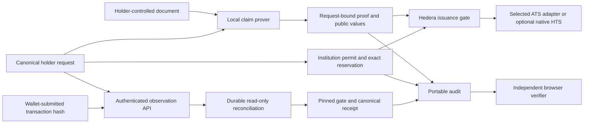

# Ultratokenizer

A token engine connecting authenticated rights, holder consent and institution-authorized issuance to independently inspectable receipts. The current asset profile is gold measured in integer milligrams; arbitrary asset units are not implemented. Document authenticity, issuer authority, transaction observation and physical custody are separate claims.

Reviewing the project? Start with the [judge walkthrough](JUDGES.md), then open the [live demo](https://ultratokenizer.trionlabs.dev/judge/). It separates what a reviewer can inspect alone from the wallet-controlled issuance run. Presenters can use the [five-minute runbook](PRESENTATION.md).

## Why this stack

| Layer    | What this project uses it for                                                                                         | Boundary                                                                                 |
| -------- | --------------------------------------------------------------------------------------------------------------------- | ---------------------------------------------------------------------------------------- |
| Hedera   | The testnet home for the Gate, verifier and token contracts, with public transaction and source-verification records | Chain state proves execution; it does not prove that physical gold exists                |
| ATS      | The deployed token graph, roles, balances and divisible transfers; the Gate adapter holds its issuance role          | ATS manages the token; the Gate decides whether a proved request may increase supply     |
| SP1      | A request-bound Groth16 proof of the accepted signed-document program and its 224-byte public output                  | The proof authenticates the implemented synthetic profile, not custody or redemption     |
| ERC-8004 | Identity records `116`, `117` and `118` for issuer, deployment and auditor-declaration discovery                     | Discovery and attribution only; the Gate never reads ERC-8004 to authorize an issuance   |

## Modules

| Module                                           | Responsibility                                                                                                                                   | Current verification boundary                                                             |
| ------------------------------------------------ | ------------------------------------------------------------------------------------------------------------------------------------------------ | ----------------------------------------------------------------------------------------- |
| packages/domain                                  | Canonical request, distinct issuer permit, EIP-712 digests and stable V2 claim identity                                                          | TypeScript signatures/boundaries and Rust/Solidity parity                                 |
| proofs/pdf-evidence                              | Bounded signed-byte authentication and separate reviewed CAdES revision primitive                                                                | Native adversarial checks; field extraction and bank trust approval remain separate       |
| proofs/enpara-evidence                           | Separate native selected-revision parser for complete available-XAU quantity and private provenance                                              | Native tests and local sample comparison; not a guest or accepted issuance profile        |
| proofs/claim-evidence, claim-guest, claim-runner | Authenticate a synthetic capsule, require its complete exact quantity, bind the request inside SP1 and expose local/network preparation commands | Native/guest checks and synthetic artifact staging; current-program Groth16 remains open  |
| contracts                                        | Versioned authority, exact reservations, aggregate pending/outstanding caps and atomic mint through HTS or admitted ATS adapters                 | Local EVM checks; Hedera testnet ATS graph and authority readback; live mint remains open |
| packages/issuance                                | Independently configured holder and issuer wallets: proof checks, reservations, permits, issuance, reconciliation and transfers                  | Real-signature and transport failure checks; live-chain acceptance remains open           |
| packages/institution                             | Node/SQLite stable-right registry, exact allocation accounting and a separately pinned RPC settlement bridge                                     | Persistent test allocation and live reservation; terminal chain settlement remains open   |
| packages/demo-service                            | Local operator service for admitted signed PDFs, exact holder requests, durable proof jobs and fresh permits                                     | Native intake and injected HTTP/chain/prover checks; live proof fulfillment remains open  |
| workers/issuance                                 | Authenticated API and SQLite Durable Object for persistent read-only observation                                                                 | Local worker runtime, restart recovery and storage-fault checks                           |
| packages/audit                                   | Portable receipts, signatures, expected event and optional explicit RPC proof verification                                                       | Offline checks remain incomplete; historical authority/inclusion remain separate          |
| apps/web                                         | Fixed-amount Orbit wallet flow and independent receipt-verification worker                                                                       | Controller/browser checks; no live issuance claimed                                       |
| Root application                                 | Interactive implementation and worker map                                                                                                        | Architecture explorer, not an issuance interface                                          |

The operator supplies admitted deployment trust pins; the holder app and document service reject each other when those pins differ. A fresh checkout contains no issuer credentials or deployment. The accepted claim profile is an explicitly synthetic capsule; full Enpara statement support is unfinished. DKIM and zkEmail authentication are not implemented; receiving a PDF by email does not authenticate the email or authorize issuance. Earlier bounded Succinct requests produced no usable proof: one remained assigned after its fulfillment deadline and one public-input control ended in verification failure. Investigation found that the requester had submitted the EVM verifier key where the Succinct network API expected its SDK program hash. The requester now derives and checks both identities separately. As observed on September 13, 2026 at 19:09 UTC, the corrected Demo 08 request was submitted and reported executed and assigned, but no proof URI had been returned. The ATS total supply and designated holder balance were both zero. Proof retrieval, local verification, deployed-verifier acceptance, the holder mint transaction and receipt reconciliation remain separate checks. A historical core proof for an earlier program does not validate the current exact-issuance program. The [judge walkthrough](JUDGES.md) records the measured state; [proof verification](proofs/README.md) documents the underlying verification boundaries.

## Trust flow



No PDF or witness enters the edge worker. A worker reporting success cannot authorize issuance: the Gate independently checks proof, holder, permit, live authority, reservation and replay state. An observed event does not establish physical custody or a complete independent audit.

Source, issuer, governor and holder are authorization roles, not necessarily independent organizations. The engine checks configured authority and required consent; it cannot establish that an institution's source statement or physical backing assertion is true. Source authentication, asset terms and token-backend capabilities must be admitted explicitly for each supported profile.

Claim profile 2 requires the request to equal the complete authenticated quantity for one right, which need not be an entire account balance. A 1 g right issues exactly 1 g or nothing. Exact reservation, minted supply and recipient increase must agree, with no fee deducted from that quantity. One successful issuance consumes the source's stable right identity in this Gate. Changing issuer does not create another consumption slot. Another Gate or chain requires an explicit continuity design.

The institution ledger maps a stable `(sourceId, recordReference)` to a persisted random claim ID. Redelivery reuses that mapping; changing a PDF, email, signing key or statement date does not define a new right. The current ledger rejects changed holder or quantity for an existing reference. It implements neither account-period mint limits nor HMAC-derived claim IDs. Institutions must distinguish genuinely separate allocations from repeated descriptions of the same backing.

The exact quantity and recipient are public from reservation broadcast, even if mint fails or the reservation is cancelled. Quantity secrecy is not a product requirement. Privacy protects government identifiers, names, account numbers and other source details within the supported local proving path. If the authenticated quantity represents a full account balance, that selected balance is public. Aggregate pending and outstanding amounts cannot exceed the configured issuer/token cap. That cap is a governance assertion, not proof of physical reserves or backing exclusivity across applications.

## Backend and obligation boundaries

ATS is the selected integration route; native HTS remains an optional backend. Both current profiles issue integer milligrams and allow later divisible transfers. The broader ATS feature set is not automatically enabled in this narrow profile.

| Backend    | Current configuration                                                                                | Not provided by this profile                                       |
| ---------- | ---------------------------------------------------------------------------------------------------- | ------------------------------------------------------------------ |
| ATS        | Admitted resolver/facet graph; sole adapter issuer; inert administrator; ERC-20 balance and transfer | Operational KYC/freeze, maintenance, recovery or redemption        |
| Native HTS | Adapter-owned supply key and treasury; native association; mint and transfer                         | Admin, KYC, freeze, wipe or pause keys; adapter burn or redemption |

Each institutional integration must identify the represented obligation, who owes fulfillment, who holds any backing, and who authorizes reserve assertions and cap changes. The engine has no universal custodian registry; its terms hashes commit to separately reviewed documents. A redemption request, token burn, reduction of outstanding liability and actual delivery are distinct events. Neither backend currently implements that settlement lifecycle, and releasing an unused reservation never clears an issued claim or its outstanding liability.

## Reconstructing an issuance

The `Issued` event alone is not a complete audit package. The successful `issue` calldata supplies the request, signatures, permit, public values and proof. Internal calls require execution traces or the original bundle; the top-level transaction need not target the Gate. Match the digests to the event, then follow `PolicyRegistered` and `RightsRegistered` for its issuer and version numbers to the program/source-key records, adapter and terms hashes. Reconstruct registration and revocation history against independently supplied deployment, runtime and program pins; obtain the actual terms separately.

These inputs exist in the protocol; a complete historical reconstruction tool is not implemented. The institution bridge checks selected transaction/state consistency under its pinned RPC, while the portable auditor keeps historical authority and inclusion unverified. An RPC proof result, consistent event history or operator-supplied reference does not authenticate its own trust pins or establish physical backing. See [audit boundaries](packages/audit/README.md) and [verifier provenance](contracts/src/vendor/sp1/README.md).

## Install and run

Node.js 22.13 or newer is required. Install the independently locked applications from the root:

```sh
npm ci --no-audit
npm --prefix apps/web ci --no-audit
npm --prefix workers/issuance ci --no-audit
npm run dev:web
```

The web app imports shared source; audit, issuance and institution builds use root tooling. The institution ledger is Node-only and never bundled into the browser. The worker has its own lockfile and compiler configuration.

The operator publishes independently approved deployment pins with `npm run prepare:web` before building the app. For the signed-document demo, `npm run demo` builds the app and starts a fixed local preview with the separately configured local document service. That service requires a private configuration, admitted synthetic PDFs, a canonical institution ledger and compiled native runners; see [document service setup](packages/demo-service/README.md).

The holder journey has three steps: upload an admitted signed PDF; verify and mint; review the transaction and receipt. Network settings load automatically. The app shows the selected institution and exact quantity, then asks the receiving wallet to authorize the complete request before any paid proof work. After proof preparation and a fresh issuer permit, a separate wallet transaction issues the tokens. Proof preparation, confirmation and unresolved transactions have distinct states; an animation does not establish success. Keep the submitted hash for reconciliation. Existing proof-package imports and alternate deployment configuration remain available only through the explicit `/?operator=1` route.

Deployment v1 selects native HTS; v2 explicitly selects HTS or the admitted ATS profile. Association is exclusive to HTS, while subsequent transfers remain divisible for both backends. Optional ENS resolution supplies a reviewed address; it grants no institutional authority.

The `/institution/` route exposes configured issuer reservation and fresh-permit operations, and governor signer admission, backing-cap and pause controls. The wallet must hold the corresponding Gate role. `/trust/` reads the pinned Gate and can compare optional ERC-8004 identity references against it. Discovery failures do not authorize or block issuance; a registry entry is not a bank licence or an independent audit.

The /verify/ route checks actual issuance receipts against a separately imported trust policy. Default offline results remain incomplete. An explicit RPC proof check calls the pinned verifier; it does not establish authenticated historical authority or inclusion. Neither route accepts a personal PDF as an already supported bank claim. The current synthetic profile is restricted to test-purpose configuration, with Hedera mainnet rejected.

For the authenticated observation worker:

```sh
npm --prefix workers/issuance run dev
```

Its checked-in trust configuration is empty, public deployment routes are disabled and operational requests fail closed. Configure reviewed identity-provider keys, origin, chain, Gate runtime hash and RPC endpoint privately before integration. /healthz reports process health, not readiness.

## Validate and build

```sh
npm run check
npm run build
npm run build:web
npm run build:workers
npm run check:contracts
npm run check:evidence
npm run check:network-requester
npm run check:parity
# Additional actual ATS lane; install its locked compiler package first:
npm --prefix contracts/ats ci --ignore-scripts --no-audit
npm --prefix packages/hedera-provisioning ci --ignore-scripts --no-audit
npm --prefix contracts/ats run compiler:fetch
npm run check:ats
npm run check:hedera-provisioning
npm run check:ats:hfs
```

The main check covers hygiene, root format/lint/types, domain, audit, issuance, institution, the local document service, web and worker modules. The separate ATS CI job rebuilds the pinned ATS contracts and tests local Gate/ATS state transitions using an isolated test verifier. It does not establish SP1 proof acceptance. Rust, Solidity and request parity have independent checks; parity rebuilds the Rust runner before comparing it with TypeScript. Contracts pin Solidity 0.8.30; CI pins Foundry 1.8.1. Native Rust uses 1.96.0; SP1 uses its separately pinned guest toolchain. Browser integration is documented in apps/web. CI configuration does not establish a successful remote CI run.

The worker build is a local deployment dry run; the web build produces static files. Neither deploys a service. The root build generates the architecture explorer and standalone map. Genuine proof, native HTS behavior and infrastructure recovery require separate evidence.

## Documentation

- [Canonical requests and permits](packages/domain/README.md)
- [PDF authentication and local proving](proofs/README.md)
- [Separate native Enpara field extraction](proofs/enpara-evidence/README.md)
- [Controlled issuance and token-backend authority](contracts/README.md)
- [Reproducible ATS sources, compiler pins and deployment limits](contracts/ats/README.md)
- [Holder and institution wallet clients](packages/issuance/README.md)
- [Durable institution rights and allocations](packages/institution/README.md)
- [Durable observation and recovery](workers/issuance/README.md)
- [Portable audit and CLI](packages/audit/README.md)
- [Web application and hosting](apps/web/README.md)

## Remaining release gates

1. Configure the actual institution signer and connect the durable stable-right ledger to verified chain outcomes and the wallet workflow. Define represented rights, current entitlement and exclusive custody/reservation procedures.
2. Complete and approve the real source profile, source-key lifecycle and authenticated field extraction. Visual extraction, a scanned authority document or a synthetic certificate cannot substitute for these.
3. Generate and independently verify the final request-bound Groth16 proof, then accept it through the pinned direct verifier and Gate on a measured host.
4. Exercise the deployed ATS backend on Hedera with the real proof, exact mint/transfer, rollback and invalid proofs. On September 13, the 19-contract graph passed exact creation, RPC/mirror runtime and ATS role checks; its 31,759-byte profile used HFS creation. Demo authority records and one ledger-bound reservation are registered. These observations do not establish successful proof acceptance or minting. Native HTS association is a separate backend requirement.
5. Complete wallet, institution, local prover, observation and audit integration; test revocation, unresolved transactions and recovery in that environment.
6. Review persistent supply authority, redemption obligations, governance and incident operations before creating a persistent token. The present mint-only adapter has no redemption or backing-release path.

These checks do not establish bank participation, physical delivery, transfer restrictions or production readiness. Those depend on their actual institutional and lifecycle design.

## Contribution rules

Use English in code, comments, UI and committed documentation. Keep module boundaries explicit and verify authorization and failure transitions through public interfaces. Guest execution, consistent receipts and test verifiers are not positive cryptographic proof acceptance.

Keep AI tooling, private plans, credentials, private documents, witnesses, core proofs, personal details and generated output Git-ignored. Use project-safe authorship and preserve meaningful history. Repository hygiene checks tracked and unignored paths, common private-data patterns, ordinary escaped strings and readable binary/UTF-16 key signatures. Its language checks are heuristics. It does not decode arbitrary encodings, decompress archives, detect every secret or establish that prose is English; human provenance and privacy review remains necessary.
