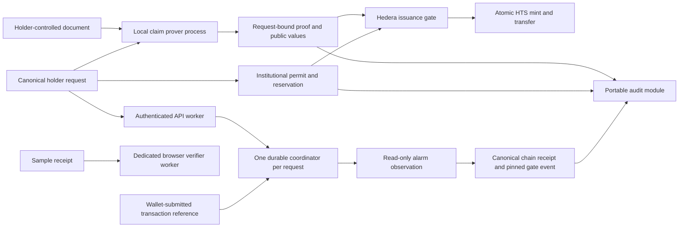

# Ultratokenizer

Private document evidence, institution-authorized issuance, and independently inspectable receipts. Document authenticity, issuer authority, transaction observation and physical custody are separate claims.

## Modules

| Module                                                 | Executable responsibility                                                                                                                                | Current verification                                                                       |
| ------------------------------------------------------ | -------------------------------------------------------------------------------------------------------------------------------------------------------- | ------------------------------------------------------------------------------------------ |
| `packages/domain`                                      | Canonical requests, distinct issuer permits, EIP-712 digests and shared issuance event ABI                                                               | TypeScript signature, mutation and boundary tests; Solidity/Rust parity                    |
| `proofs/pdf-evidence`                                  | Bounded single-revision RSA/SHA-256 PDF authentication and signer pinning                                                                                | Native adversarial tests and SP1 execution                                                 |
| `proofs/claim-evidence`, `claim-guest`, `claim-runner` | Authenticate a versioned synthetic gold capsule, keep capacity private, bind the complete request inside SP1, and expose explicit local proving commands | Native, guest and cross-language checks; see proof documentation for actual proving status |
| `contracts`                                            | Versioned registries, live issuer permits, reservations, single-use claims, atomic HTS mint/transfer and replay protection                               | Local EVM tests, fuzzing and HTS failure model; no Hedera deployment                       |
| `workers/issuance`                                     | Authenticated API plus a SQLite Durable Object and alarm worker for persistent transaction observation                                                   | Real local worker runtime, restart recovery and storage fault injection                    |
| `packages/audit`                                       | Portable receipt parsing, independent signature/claim checks, expected chain event and offline CLI                                                       | Real signatures, tampering and contract ABI tests; missing evidence is explicit            |
| `apps/web`                                             | Modular Orbit presentation, sample orchestration, dedicated receipt-verification Web Worker and independent `/verify/` route                             | Responsive browser, worker cancellation/failure, CSP and accessibility checks              |
| Root application                                       | Interactive implementation and worker map                                                                                                                | Architecture visualization; not an issuance interface                                      |

These are implemented modules with explicit release gates. The browser journey still simulates issuance. No real custodian, production identity provider, live issuer workflow or Hedera deployment is connected. The accepted claim document is a synthetic signed capsule profile, not full Enpara statement support. A real local core proof was generated and independently verified. It proves execution without zero knowledge and remains private; consult [proof verification](proofs/README.md) for the measured state and pending Groth16 wrapper.

## Worker and trust flow



No PDF or witness enters the edge worker. A worker reporting success cannot authorize issuance: the contract independently checks the proof, holder, issuer permit, live policy and replay/capacity state. An observed event does not establish physical custody or a complete independent audit.

The first claim profile permits one issuance per authenticated claim. It privately proves that the requested quantity is within the signed capacity. Unused capacity is not disclosed and cannot be issued again under the same claim identity. Institutional reservations separately enforce deliberately allocated quantities. Cross-application backing exclusivity remains an issuer responsibility.

## Install and run

Node.js 22.13 or newer is required. Install the independently locked applications from the root:

```sh
npm ci --no-audit
npm --prefix apps/web ci --no-audit
npm --prefix workers/issuance ci --no-audit
npm run dev:web
```

The web app consumes canonical domain source whose dependencies are installed at the root. Audit builds also use root tooling. The worker has its own lockfile and compiler configuration.

Open the Vite URL. The sample journey supports exact amounts, disclosure consent, three issuer checks, proof rejection/recovery and receipt export. `/verify/` inspects sample receipts in a separate Web Worker with no application API dependency. It reports digest consistency and explicitly unverified authority. It does not accept personal PDFs or simulate a real proof result.

For the authenticated worker:

```sh
npm --prefix workers/issuance run dev
```

Its checked-in trust configuration is empty, its public deployment routes are disabled, and operational requests fail closed. Configure the exact identity-provider keys, origin, chain, gate runtime hash and RPC endpoint before integration. `/healthz` is process health, not production readiness.

## Validate and build

```sh
npm run check
npm run build
npm run build:web
npm run build:workers
npm run check:contracts
npm run check:evidence
npm run check:parity
```

`check` validates repository hygiene, root formatting/lint/types, domain, audit, Svelte and worker modules. Linting first asks the worker module to generate its binding types, so a fresh checkout does not depend on ignored development output. Rust and Solidity have explicit checks and separate CI jobs. Contracts pin Solidity 0.8.30 and CI pins Foundry 1.8.1. Native Rust uses 1.96.0; SP1 has a separate locked toolchain described under `proofs/`. Browser worker integration is documented under `apps/web/`. CI configuration does not establish that a remote CI run occurred.

`build:workers` performs a local deployment dry run. `build:web` produces static files. Neither deploys a service. The root `build` generates the architecture explorer and standalone HTML map. Production proving, real HTS acceptance, infrastructure recovery and independent security review have separate release gates; they are not replaced by local test doubles.

## Module documentation

- [Canonical requests and permits](packages/domain/README.md)
- [PDF, claim guest and local proving](proofs/README.md)
- [Controlled issuance and HTS authority](contracts/README.md)
- [Durable workers, authentication and recovery](workers/issuance/README.md)
- [Portable audit library and CLI](packages/audit/README.md)
- [Web application, worker lifecycle and hosting](apps/web/README.md)

## Production release gates

1. Approve the real issuer, represented rights, holder authentication and custody/reservation procedures.
2. Review a representative supported source format and independently approve its signing keys. Do not substitute visual PDF extraction or a synthetic certificate for source authentication.
3. Generate and independently verify a real request-bound Groth16 proof, pin the exact guest and outer verifier, and measure the intended proving host.
4. Deploy and exercise the reviewed contracts on Hedera testnet with real HTS behavior, including associations, fees, mint/transfer rollback and failed proofs.
5. Connect the holder wallet, issuer approval workflow, local prover, worker authentication and audit export. Exercise revoked authority, uncertain transactions and disaster recovery against deployed infrastructure.
6. Complete an independent security review, dependency review, operational ownership, alerts and recovery procedures before a production launch.

Token issuance alone does not implement redemption, gold delivery, transfer restrictions or ATS integration. Those capabilities require explicit rights and lifecycle design.

## Contribution rules

Use English for code, comments, UI and committed documentation. Keep each module's interface small and responsibilities explicit. Verify authorization, failure transitions and cross-module contracts through public interfaces. Never label guest execution, an internally consistent receipt or a test verifier as cryptographic proof acceptance.

Keep AI tooling, private planning and scratch work Git-ignored. Never commit credentials, private documents, proving witnesses, private core proofs, personal contact details or generated build output. Use a GitHub no-reply or project `.invalid` address for commit authorship. Preserve meaningful incremental history.

`npm run check:hygiene` checks tracked paths, common private-data patterns, commit email addresses and Turkish characters. Human review remains necessary for language, provenance and private data.
