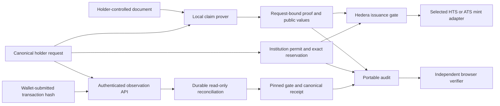

# Ultratokenizer

Private document evidence, institution-authorized issuance and independently inspectable receipts. Document authenticity, issuer authority, transaction observation and physical custody are separate claims.

## Modules

| Module                                           | Responsibility                                                                                                                                   | Current verification boundary                                                               |
| ------------------------------------------------ | ------------------------------------------------------------------------------------------------------------------------------------------------ | ------------------------------------------------------------------------------------------- |
| packages/domain                                  | Canonical request, distinct issuer permit, EIP-712 digests and stable V2 claim identity                                                          | TypeScript signatures/boundaries and Rust/Solidity parity                                   |
| proofs/pdf-evidence                              | Bounded signed-byte authentication and separate reviewed CAdES revision primitive                                                                | Native adversarial checks; field extraction and bank trust approval remain separate         |
| proofs/enpara-evidence                           | Separate native selected-revision parser for complete available-XAU quantity and private provenance                                              | Native tests and local sample comparison; not a guest or accepted issuance profile          |
| proofs/claim-evidence, claim-guest, claim-runner | Authenticate a synthetic capsule, require its complete exact quantity, bind the request inside SP1 and expose local/network preparation commands | Native/guest checks and synthetic artifact staging; current-program Groth16 remains open    |
| contracts                                        | Versioned authority, exact reservations, aggregate pending/outstanding caps and atomic mint through HTS or admitted ATS adapters                 | Local EVM, failure models and actual-verifier rejection tests; no native deployment         |
| packages/issuance                                | Independently configured holder and issuer wallets: proof checks, reservations, permits, issuance, reconciliation and transfers                  | Real-signature and transport failure checks; live-chain acceptance remains open             |
| packages/institution                             | Node/SQLite stable-right registry and exact pending/issued allocation accounting                                                                 | Private durable storage and caller-supplied outcomes; trusted chain bridge remains separate |
| workers/issuance                                 | Authenticated API and SQLite Durable Object for persistent read-only observation                                                                 | Local worker runtime, restart recovery and storage-fault checks                             |
| packages/audit                                   | Portable receipts, signatures, expected event and optional explicit RPC proof verification                                                       | Offline checks remain incomplete; historical authority/inclusion remain separate            |
| apps/web                                         | Fixed-amount Orbit wallet flow and independent receipt-verification worker                                                                       | Controller/browser checks; no live issuance claimed                                         |
| Root application                                 | Interactive implementation and worker map                                                                                                        | Architecture explorer, not an issuance interface                                            |

The product requires separately supplied deployment trust pins and a request-bound proof/permit bundle, then uses the actual connected wallet and RPC. It has no default issuer or deployment. The accepted claim profile is an explicitly synthetic capsule; full Enpara statement support is unfinished. The current synthetic V2 ELF and `PrivateStdin` witness have been staged on Succinct, without a proof request. A historical core proof was independently verified for the earlier program, without zero knowledge; it does not validate the current exact-issuance program. See [proof verification](proofs/README.md) for the measured state and pending Groth16 request.

## Trust flow



No PDF or witness enters the edge worker. A worker reporting success cannot authorize issuance: the Gate independently checks proof, holder, permit, live authority, reservation and replay state. An observed event does not establish physical custody or a complete independent audit.

Claim profile 2 requires the request to equal the complete authenticated quantity. Exact reservation, minted supply and recipient increase must agree, with no fee deducted from that quantity. One successful issuance consumes the source's stable right identity in this Gate. Changing issuer does not create another consumption slot. Another Gate or chain requires an explicit continuity design.

The exact quantity and recipient are public from reservation broadcast, even if mint fails or the reservation is cancelled. Quantity secrecy is not a product requirement. Privacy protects government identifiers, names, account numbers and other source details within the supported local proving path. If the authenticated quantity represents a full account balance, that selected balance is public. Aggregate pending and outstanding amounts cannot exceed the configured issuer/token cap. That cap is a governance assertion, not proof of physical reserves or backing exclusivity across applications.

## Install and run

Node.js 22.13 or newer is required. Install the independently locked applications from the root:

```sh
npm ci --no-audit
npm --prefix apps/web ci --no-audit
npm --prefix workers/issuance ci --no-audit
npm run dev:web
```

The web app imports shared source; audit, issuance and institution builds use root tooling. The institution ledger is Node-only and never bundled into the browser. The worker has its own lockfile and compiler configuration.

Open the Vite URL and import an independently approved deployment configuration and a public issuance bundle. Review its fixed amount and recipient, connect the matching wallet, validate, sign and submit. Keep the submitted hash for reconciliation. Deployment v1 selects native HTS; v2 explicitly selects HTS or the admitted ATS profile. Association is exclusive to HTS, while subsequent transfers remain divisible for both backends. Optional ENS resolution supplies a reviewed address; it grants no institutional authority.

The /verify/ route checks actual issuance receipts against a separately imported trust policy. Default offline results remain incomplete. An explicit RPC proof check calls the pinned verifier; it does not establish authenticated historical authority or inclusion. Neither route accepts a personal PDF as an already supported bank claim. The current synthetic profile is restricted to test-purpose configuration, with Hedera mainnet rejected.

For the authenticated observation worker:

```sh
npm --prefix workers/issuance run dev
```

Its checked-in trust configuration is empty, public deployment routes are disabled and operational requests fail closed. Configure reviewed identity-provider keys, origin, chain, Gate runtime hash and RPC endpoint privately before integration. /healthz reports process health, not readiness.

## Validate and build

```sh
npm run check
npm run build
npm run build:web
npm run build:workers
npm run check:contracts
npm run check:evidence
npm run check:parity
# Additional actual ATS lane; install its locked compiler package first:
npm --prefix contracts/ats ci --ignore-scripts --no-audit
npm --prefix contracts/ats run compiler:fetch
npm run check:ats
```

The main check covers hygiene, root format/lint/types, domain, audit, issuance, institution, web and worker modules. The separate ATS CI job rebuilds the pinned ATS contracts and tests local Gate/ATS state transitions using an isolated test verifier. It does not establish SP1 proof acceptance. Rust, Solidity and request parity have independent checks; parity rebuilds the Rust runner before comparing it with TypeScript. Contracts pin Solidity 0.8.30; CI pins Foundry 1.8.1. Native Rust uses 1.96.0; SP1 uses its separately pinned guest toolchain. Browser integration is documented in apps/web. CI configuration does not establish a successful remote CI run.

The worker build is a local deployment dry run; the web build produces static files. Neither deploys a service. The root build generates the architecture explorer and standalone map. Genuine proof, native HTS behavior and infrastructure recovery require separate evidence.

## Documentation

- [Canonical requests and permits](packages/domain/README.md)
- [PDF authentication and local proving](proofs/README.md)
- [Separate native Enpara field extraction](proofs/enpara-evidence/README.md)
- [Controlled issuance and HTS authority](contracts/README.md)
- [Reproducible ATS sources, compiler pins and deployment limits](contracts/ats/README.md)
- [Holder and institution wallet clients](packages/issuance/README.md)
- [Durable institution rights and allocations](packages/institution/README.md)
- [Durable observation and recovery](workers/issuance/README.md)
- [Portable audit and CLI](packages/audit/README.md)
- [Web application and hosting](apps/web/README.md)

## Remaining release gates

1. Configure the actual institution signer and connect the durable stable-right ledger to verified chain outcomes and the wallet workflow. Define represented rights, current entitlement and exclusive custody/reservation procedures.
2. Complete and approve the real source profile, source-key lifecycle and authenticated field extraction. Visual extraction, a scanned authority document or a synthetic certificate cannot substitute for these.
3. Generate and independently verify the final request-bound Groth16 proof, then accept it through the pinned direct verifier and Gate on a measured host.
4. Complete ATS provisioning/admission and exercise the selected backend on Hedera with fees, exact mint/transfer, rollback and invalid proofs. The normal-source profile builds locally, but its 31,759-byte creation input exceeds the documented inline creation-data limit; the HFS-backed direct-creation route remains unimplemented. Native HTS association is a separate backend requirement. Record deployed identities and transactions.
5. Complete wallet, institution, local prover, observation and audit integration; test revocation, unresolved transactions and recovery in that environment.
6. Review persistent supply authority, redemption obligations, governance and incident operations before creating a persistent token. The present mint-only adapter has no redemption or backing-release path.

These checks do not establish bank participation, physical delivery, transfer restrictions or production readiness. Those depend on their actual institutional and lifecycle design.

## Contribution rules

Use English in code, comments, UI and committed documentation. Keep module boundaries explicit and verify authorization and failure transitions through public interfaces. Guest execution, consistent receipts and test verifiers are not positive cryptographic proof acceptance.

Keep AI tooling, private plans, credentials, private documents, witnesses, core proofs, personal details and generated output Git-ignored. Use project-safe authorship and preserve meaningful history. Repository hygiene checks tracked and unignored paths, common private-data patterns, ordinary escaped strings and readable binary/UTF-16 key signatures. Its language checks are heuristics. It does not decode arbitrary encodings, decompress archives, detect every secret or establish that prose is English; human provenance and privacy review remains necessary.
